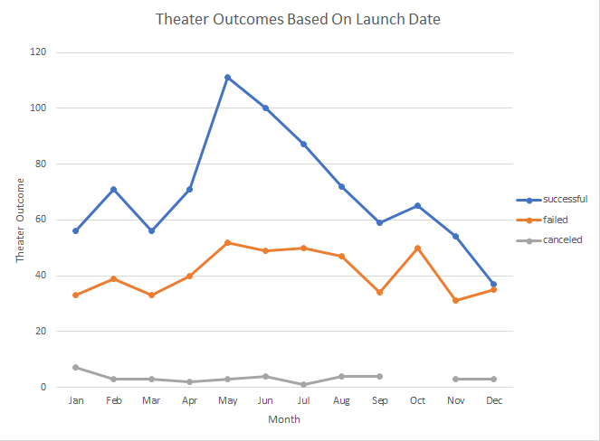
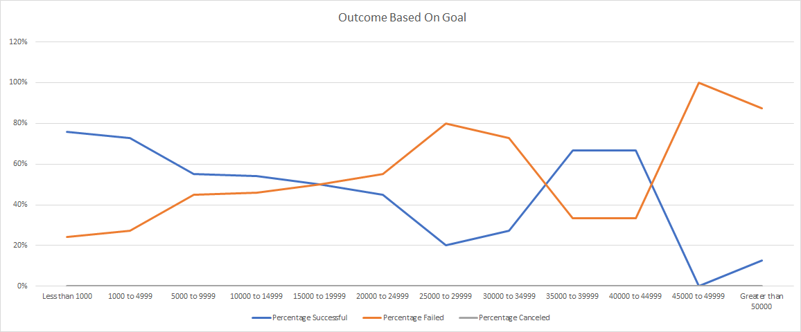

# kickstarter-analysis
Performing Analysis on KickStarter data to uncover trends 

## Overview of Project/ Purpose 

Louise’s play Fever came close to its fundraising goal in a short amount of time. Now, she wants to know how different campaigns fared in relation to their launch dates and their funding goals. Using the Kickstarter dataset, I visualize campaign outcomes based on their launch dates and their funding goals. The purpose of this analysis is to give Louise’s information on which months “theater” are successful, failed, and canceled. Additionally, show the funding percentage of “plays” that are successful, failed, and canceled. This will help Louise know when it is best to launch a campaign and how much funding to ask.

## Analysis and Challenges

In the excel sheet labeled “Theater Outcomes Based by launch Date” I generated a pivot table and line graph to represent the theater outcomes based on launch date. In this line graph,see image below, we can say during the months of May and June have the most successful outcomes for the Category theater. In the pivot table we see the during the month of May there were 111 successful theater campaigns and in June there were 100 successful theater campaigns. Additionally, you can tell the least successful theater campaigns happened during the month of December. The number of successful campaigns in December was 37. 

 
In the excel sheet labeled “Outcomes Base on Goals Chart” represents the goal amounts and the percentage successful for the “plays” subcategory. Here we see goals between $0 and $5000 are more likely to be successful with goal less than $1000 have a success rate of 76% and $1000 to $4999 have a goal success rate of 73%. Funding starts to steadly decrease after goals set between $1000 to $4999.

### Challenges
I face several challenges when working with the data set. In “Theater Outcomes Base on Launch Date” I had trouble with making the pivot table. With the pivot table I had issues with switching the columns of successful, failed, and canceled. I eventually just googled how to switch columns in the pivot table. I just had to right click inside the table and select the “move” in the drop down and selected the column to move to the front of the data set. 

In the “Outcome Based on Goal” I had trouble with the COUNTIFS() function. I did not get the hint that was provided in the module. I then got assistance from another student who explained what I was doing wrong. I was not filling out the complete criteria range. It should be COUNTIFS(Criteria_range1, Criteria1). I also had issues with generating the line graph. I was selecting the entire table I created, however, I only need to select goals, percentage successful, failed and canceled. 

## Results 

Based on Theater Outcomes Based on Launch Date we can safely assume that during the months of May and June are the best times to start and fund theater campaigns. Additionally, based on the data it would be best not to start a campaign between the months of November and December. The Number of Successful campaigns starts to decrease after May. Based on Outcome based on Goals chart we can assume it would be best to set the campaign goal amount between $1000 and $5000. The limitations of this data set is that it only represents the category of “Theater” and subcategory “plays”. It does not account or represent all the number of successful, failed, or canceled campaigns. I believe bar charts would have been easier to use in these data sets. The bar chart will show the comparison, for “Theater Outcome Base on Launch date”, between months for successful, failed, and canceled. It would be easier to view the highest successful, failed, and canceled. For “Outcome Based on Goals” a bar chart can show more easily the which funding goals were successful, failed, and canceled.
